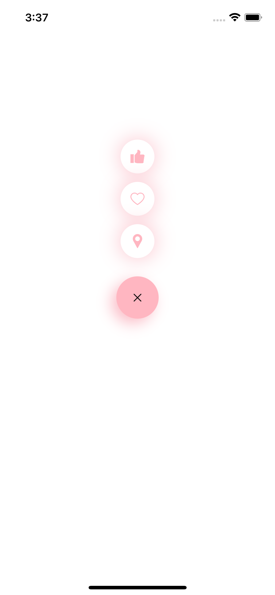

# react-native-animated-floating-button

animated button

<!--  -->


## Installation

```sh
npm install react-native-animated-floating-button
```

## Usage


```js
import { AnimatedFloatingButton } from 'react-native-animated-floating-button'

// ...

<AnimatedFloatingButton menuImage={require('./images/plus.png')} iconColors={'lightblue'} style={{backgroundColor: 'lightblue'}} image1={require('./images/pin.png')} image2={require('./images/love.png')}  image3={require('./images/like.png')}/>
